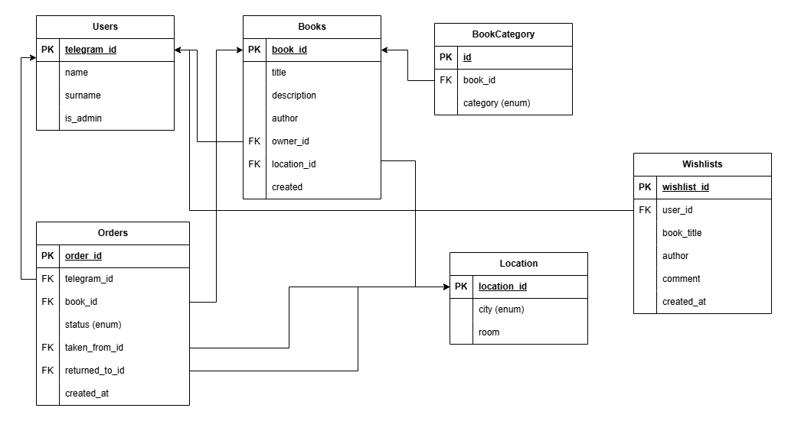

## 📖 About the project

“App Name” is a book rental app within the same company (office), where employees can easily rent books and share them with colleagues.

## 🎯 Why is this project needed?

📚 Employee development - access to books helps to improve skills and broaden horizons.

🤝 Building team spirit - sharing books promotes informal communication and knowledge sharing.

🏢 Creating company culture - supporting a reading initiative makes the company more attractive to employees.

💰 Saving money - no need to buy books that just take up space after reading.

🏠 Convenience - you can read books anywhere and then easily return them.

📖 Bookshelf replenishment - users can suggest new books to add to the library.

## 🔄 How does the app work?

0️⃣ Registration - the employee registers in the system.

1️⃣ Book Selection - the employee selects a book from the catalog in the app.

2️⃣ Reservation - reserves it so no one else picks it up before.

3️⃣ Renting - takes the book from the shelf in the office and marks it in the system.

4️⃣ Return - returns the book after reading it, making it available to coworkers.

## 🔥 Who would be suitable for this bot?

This app will be useful for anyone who wants to organize convenient book rentals in their company or workspace.

## 📦 Used Libraries  

- **PostgreSQL** – the primary database  
- **SQLAlchemy** – ORM for working with the database and models  
- **Alembic** – a migration management tool 
- **asyncpg** – an asynchronous PostgreSQL driver used with SQLAlchemy
- **Aiogram** – an asynchronous framework for building Telegram bots  
- **pytest** – a testing framework for writing and running unit tests  
- **Docker** – a containerization platform

## 🗄️ Database Schema 




## 🚀 How to Run the Application

1️⃣ Create a .env file in the root directory. See the example in env.example.

2️⃣ Run the application using Docker: docker-compose up --build -d

3️⃣ Run database migrations and setup: make all


## ✅ Test Coverage Report

Below is the latest code coverage report based on the test results:

<!-- COVERAGE START -->
```
Name                          Stmts   Miss  Cover
-------------------------------------------------
db/queries/book_crud.py         109      8    93%
db/queries/location_crud.py      85      6    93%
db/queries/order_crud.py        109      5    95%
db/queries/user_crud.py          70      0   100%
db/queries/wishlist_crud.py      68      5    93%
-------------------------------------------------
TOTAL                           441     24    95%
```
<!-- COVERAGE END -->
